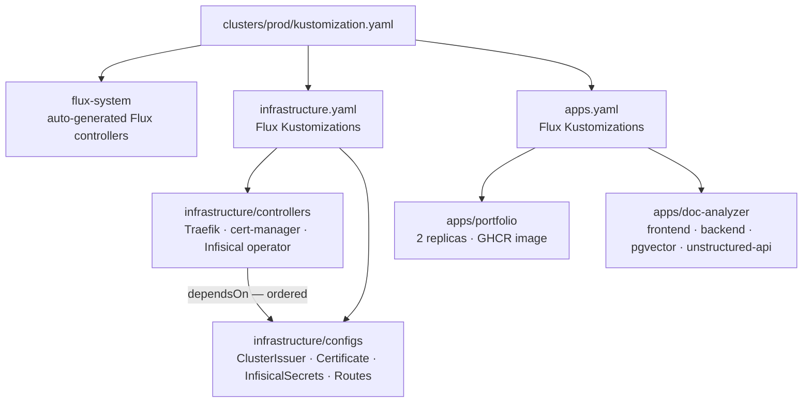
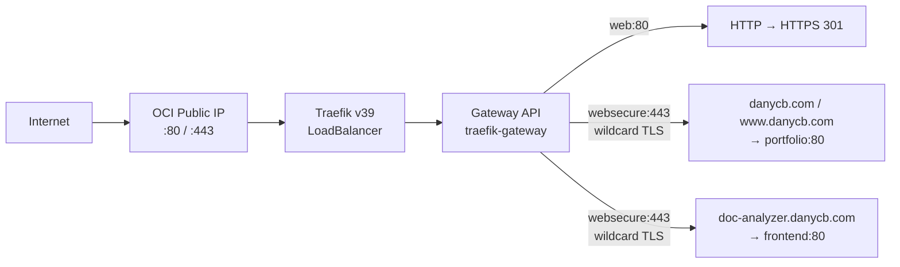
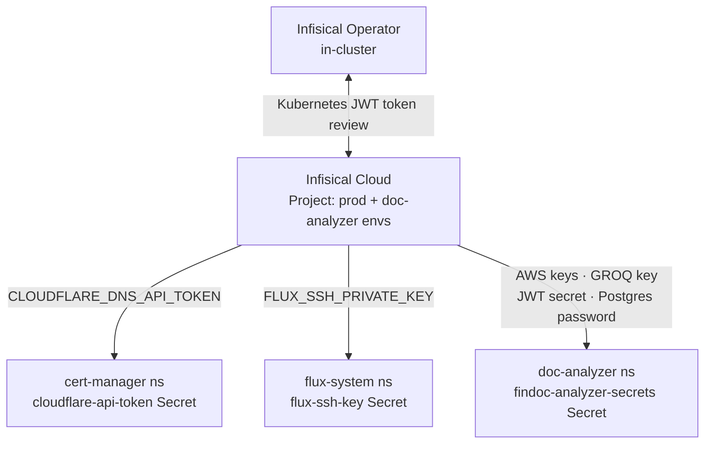
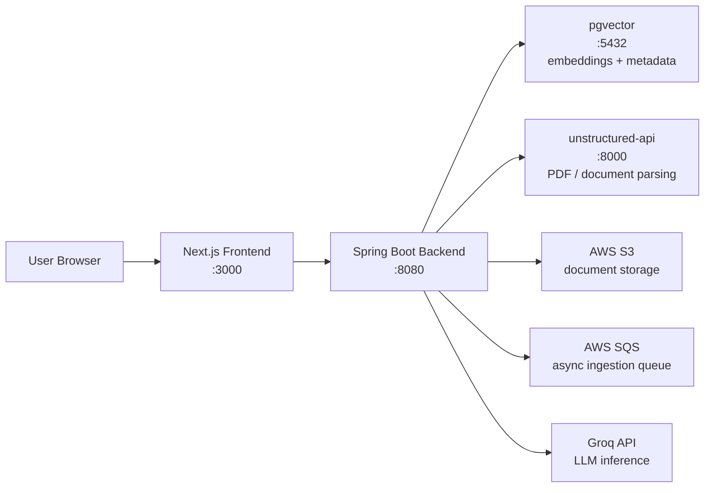
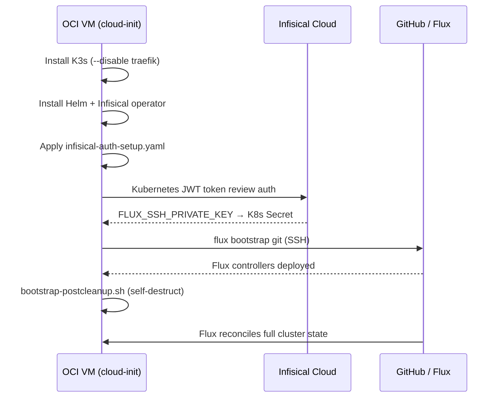
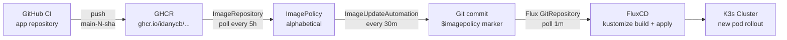
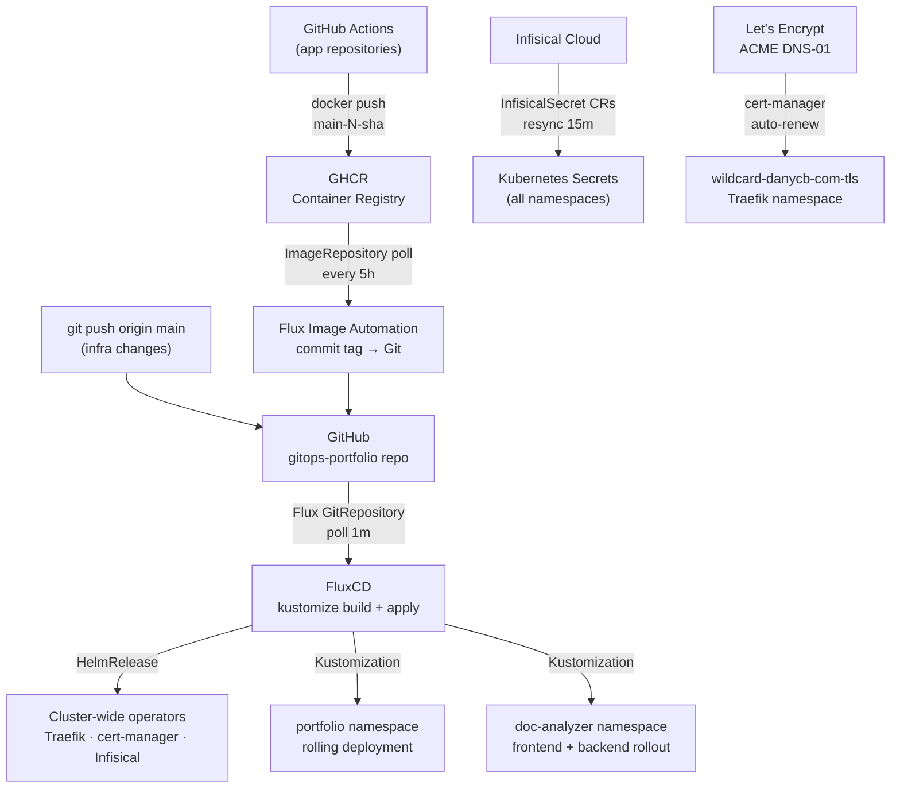

## Executive Summary

Running production-grade infrastructure on a free-tier cloud instance sounds like a bad idea — until you do it right. This project is a fully declarative GitOps repository that provisions and operates a personal portfolio cluster on Oracle Cloud Infrastructure's ARM (Ampere A1) compute, with no manual SSH steps after the initial VM click. A single generated `cloud-init.yaml` payload installs K3s, bootstraps Infisical for secret management, and hands full control to FluxCD — which then continuously reconciles the cluster's entire desired state from Git. The result is a self-healing, automatically-updating production environment hosting two public-facing applications, built on battle-tested open-source tooling and zero ongoing maintenance cost.

---

## Project Overview

The repository solves two problems that are easy to underestimate:

**1. Zero-touch node provisioning.** Recreating a cluster from scratch — new VM, fresh OS, no pre-existing state — should take minutes, not an afternoon. A single generated `cloud-init.yaml` payload handles the entire journey from OS boot to running cluster: dependency installation, K3s setup, Infisical operator bootstrap, Flux bootstrap, and secure self-destruction of bootstrap artifacts.

**2. Declarative cluster state.** Every Kubernetes resource — ingress rules, TLS certificates, application deployments, network policies, and secret references — lives in Git. FluxCD continuously reconciles the live cluster against this repository, making every change auditable, reviewable, and reversible.

The cluster hosts two public applications:

| Domain                    | Application                                   |
| ------------------------- | --------------------------------------------- |
| `danycb.com`              | Personal portfolio website (Next.js / SSR)    |
| `doc-analyzer.danycb.com` | FinDoc — an LLM-powered RAG document analyzer |

FinDoc is a multi-component application: a Spring Boot backend, a Next.js frontend, a pgvector database, an Unstructured.io document parsing service, AWS S3/SQS for storage and async ingestion, and Groq for LLM inference.

**My role**: I designed the full architecture, wrote every Kubernetes manifest, built the bootstrap pipeline, and made every technical decision described in this case study.

---

## Architecture & System Design

The system is organized into three logical layers: cluster compute, GitOps reconciliation, and application workloads.

### GitOps Reconciliation Hierarchy

The `dependsOn` relationship between `infrastructure-controllers` and `infrastructure-configs` is critical: cert-manager CRDs must exist before a `ClusterIssuer` can be applied, and the Infisical operator must be running before `InfisicalSecret` CRs can reconcile. Flux enforces this ordering declaratively, eliminating race conditions on cold-start.

### Ingress & TLS Flow

A single wildcard certificate (`*.danycb.com` + apex `danycb.com`) is issued via Let's Encrypt ACME DNS-01 through Cloudflare's API, stored in the `traefik` namespace, and shared across all current and future subdomains. No HTTP-01 endpoint exposure required.

### Secrets Architecture

No secrets live in Git. Every sensitive value is sourced from Infisical Cloud using Kubernetes-native authentication — the cluster proves its identity using its own service account JWT tokens, with no long-lived static credentials stored anywhere.

### doc-analyzer Internal Data Flow

The backend uses an `initContainer` to wait for pgvector readiness before starting — a simple but important guard against startup race conditions in a single-node environment.

---

## Key Technical Decisions

### ADR-01: FluxCD over Argo CD

**Decision**: Use FluxCD v2 as the GitOps operator.

FluxCD's integrated Image Automation controllers (`image-reflector-controller` + `image-automation-controller`) were the primary driver. They poll GHCR, select images by policy, commit updated tags back to Git, and trigger redeploys — a full closed loop without requiring external CI involvement. Argo CD has no native equivalent. Flux's lighter resource footprint also suits a constrained single-node cluster.

**Tradeoff**: Flux commits image-tag updates back to `main` as `fluxcdbot`, mixing automated commits with human changes. The alphabetical image policy also makes the tag naming convention (`main-<N>-<sha>`) load-bearing.

### ADR-02: K3s with Traefik Disabled, Re-owned by Flux

**Decision**: Install K3s with `--disable traefik`, then deploy Traefik via a Flux `HelmRelease`.

K3s bundles Traefik by default. Running both K3s and Flux managing the same controller creates resource ownership conflicts. Disabling it at install time gives Flux exclusive ownership from the first boot. A brief window exists between K3s start and Flux deploying Traefik where no ingress is available — acceptable for a personal cluster.

### ADR-03: Infisical over Sealed Secrets / SOPS

**Decision**: Use Infisical operator with Kubernetes auth for all secret management.

Sealed Secrets and SOPS encrypt secrets for Git storage, but both require key management and key rotation strategies. Infisical externalizes all secret storage to a managed cloud service while relying solely on the cluster's Kubernetes identity for authentication. This means zero long-lived credentials anywhere in the system. `instantUpdates: true` enables near-real-time secret rotation.

**Tradeoff**: Infisical Cloud becomes a dependency. A transient outage blocks rotation but does not break already-running pods.

### ADR-04: Wildcard TLS via DNS-01

**Decision**: Issue a single wildcard cert using ACME DNS-01 through Cloudflare.

HTTP-01 challenges require an exposed port 80 endpoint and cannot issue wildcards. DNS-01 via Cloudflare API supports wildcard issuance and works independently of port exposure. One cert covers all subdomains, simplifying the TLS lifecycle entirely.

### ADR-06: Gateway API over Classic Ingress

**Decision**: Configure Traefik exclusively in Gateway API mode.

Traefik v39 supports both APIs, but only the Gateway API provider is enabled (`providers.kubernetesGateway.enabled: true`; Ingress and CRD providers disabled). All routing uses `HTTPRoute` resources, aligning with the upstream direction of Kubernetes networking. Classic `Ingress` objects are silently ignored.

### ADR-07: Two-layer Infrastructure (controllers → configs)

**Decision**: Split infrastructure into `controllers` (Helm releases) and `configs` (CRs), with `configs` depending on `controllers`.

cert-manager CRDs must exist before a `ClusterIssuer` can be applied. The Infisical operator must be running before `InfisicalSecret` CRs can reconcile. Flux's `dependsOn` enforces this ordering declaratively, eliminating CRD-not-found errors during cold cluster starts.

---

## Implementation Highlights

### The Bootstrap Chicken-and-Egg Problem

Flux needs an SSH key to connect to GitHub. That key lives in Infisical. Infisical's operator must be running in the cluster. But the cluster does not exist yet.

I solved this with a two-phase bootstrap embedded in `cloud-init.yaml`:

Phase 1 installs the Infisical operator and pulls only the Flux SSH key from Infisical Cloud — the minimum viable secret. Phase 2 uses that key to bootstrap Flux, which then takes full ownership of the cluster going forward. The `bootstrap-postcleanup.sh` script removes all bootstrap artifacts from the K3s manifests directory and deletes `/opt/bootstrap-runtime` entirely, leaving no residual bootstrap footprint. The temporary SSH key is wiped using `shred`.

### Automated Image Deployment Loop

Every application workload participates in a fully automated image update pipeline requiring no manual intervention after a code push:

The `# {"$imagepolicy": "flux-system:..."}` marker comment in each deployment YAML is the mechanism that tells the Image Automation controller exactly which field to update. It is small, but load-bearing.

### Network Isolation by Default

Each application namespace enforces a default-deny ingress baseline. Explicit `NetworkPolicy` rules permit only:

- Same-namespace pod-to-pod communication
- Traefik namespace → application frontend on `:3000`

The backend, pgvector, and unstructured-api are reachable only within the `doc-analyzer` namespace. No path exists from the internet to internal services except through the Gateway and the frontend.

---

## Performance, Reliability & Constraints

| Metric                              | Value                                            |
| ----------------------------------- | ------------------------------------------------ |
| Git reconciliation latency          | ~1 minute (Flux git polling interval)            |
| Flux Kustomization recheck interval | 10 minutes                                       |
| New image deployment latency        | Up to ~5.5 hours (5h GHCR poll + 30m automation) |
| Secret rotation visibility          | ~15 minutes (Infisical resync interval)          |
| TLS certificate validity            | 90 days, auto-renewed via cert-manager           |
| Total peak CPU budget               | ~4.5 cores against 4 OCI ARM OCPUs               |
| pgvector PVC size                   | 100Mi (local-path, no backup)                    |

**Reliability**: The cluster runs on a single OCI node. Any node reboot or OCI maintenance event causes full downtime across all services. The `pgvector` PVC is backed by K3s local-path storage with no backup mechanism — document embeddings and metadata are at risk on node failure.

**Performance**: The Spring Boot JVM is configured with `-XX:MaxRAMPercentage=70`, giving an effective heap of ~1075Mi within a 1536Mi limit. The `unstructured-api` (up to 1200m CPU, 3Gi RAM) and `pgvector` (1200m, 3Gi) compete for resources on the same node, and the cluster approaches its CPU ceiling at full load.

**Security gaps**: No pod security contexts are defined across any deployment (non-root users, read-only root filesystems, dropped capabilities). The K3s API server (port 6443) is internet-exposed, relying solely on TLS client certificates. The doc-analyzer frontend has no resource limits, creating a noisy-neighbor risk on the shared node.

---

## Deployment / Release Architecture

Local validation runs via `run-verify.sh`, chaining four checks in order: `yamllint` → `kubeconform` (against pinned CRD JSON schemas generated from Helm charts) → `kustomize build` (every directory containing a `kustomization.yaml`) → `flux kustomization validate` (dry-run for all Flux Kustomization CRs). The pipeline is complete and mature; it awaits a GitHub Actions workflow to enforce it automatically on PRs.

---

## Future Improvements

1. **GitHub Actions CI** — Wire `run-verify.sh` into a PR check to block invalid YAML before Flux can reconcile it to the cluster.
2. **Fix image tag sort order** — Zero-pad the commit count in CI tag format (`main-0006-sha` instead of `main-6-sha`) to make alphabetical ordering correct at any commit count.
3. **PVC backup strategy** — Add a CronJob or Velero-based backup for the `pgvector` PVC. The current 100Mi of embeddings has no recovery path on node failure.
4. **Pod security hardening** — Define `securityContext` on all pods: non-root UID, `readOnlyRootFilesystem: true`, `drop: [ALL]` capabilities. Standard hardening pass.
5. **Resource limits on doc-analyzer frontend** — Add CPU and memory requests/limits to prevent a misbehaving frontend from starving co-located workloads.
6. **Helm drift detection** — Enable `driftDetection: enabled` on Traefik and cert-manager `HelmRelease` objects to surface any manual `kubectl` edits.
7. **Restrict K3s API access** — Move port 6443 behind an IP allowlist or VPN; internet exposure relying on TLS certs alone is a hardening gap.
8. **Lightweight monitoring stack** — A VictoriaMetrics + Grafana deployment would provide cluster health visibility without manual `kubectl` inspection, at a resource cost the OCI node can sustain.

---

## Conclusion

This project demonstrates that serious infrastructure engineering does not require a budget or a team. By composing FluxCD's GitOps primitives, Infisical's zero-credential secret model, cert-manager's automated TLS lifecycle, and a carefully staged bootstrap sequence, I built a production-grade Kubernetes platform that provisions itself from a single cloud-init payload, self-heals from drift, and automatically deploys new application versions with nothing more than a `git push`.

The decisions here reflect an understanding of tradeoffs, not just tool selection: choosing Flux for its image automation loop, separating infrastructure layers to eliminate CRD race conditions, solving the bootstrap chicken-and-egg problem with a two-phase init, and designing a secrets architecture where no long-lived credentials exist anywhere in the system. The known limitations — single node, no monitoring, no CI enforcement — are documented, understood, and already queued for improvement.

This is the kind of platform I would want to run in production — and it already is.
