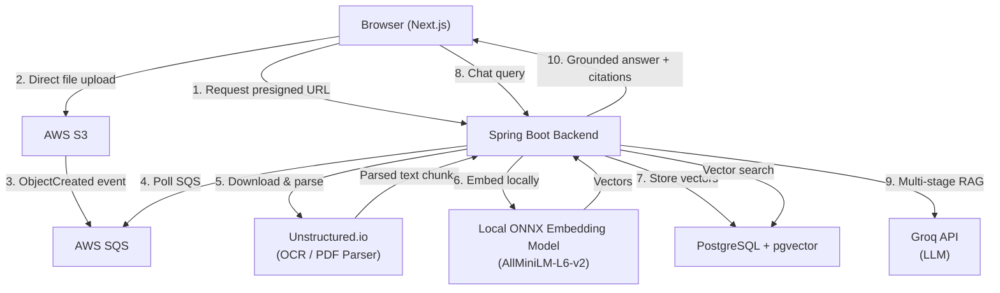
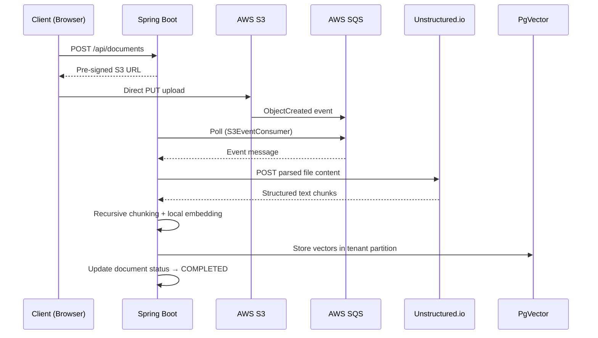
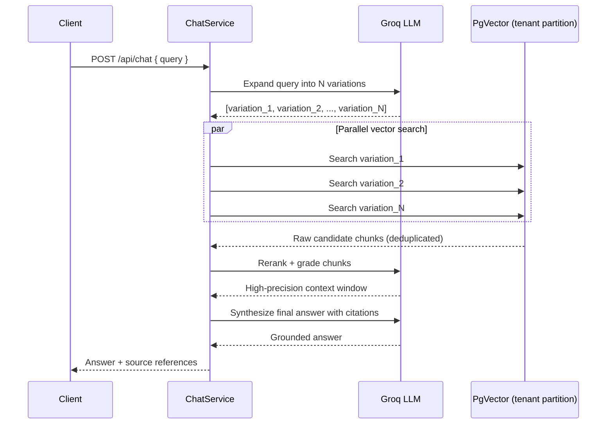
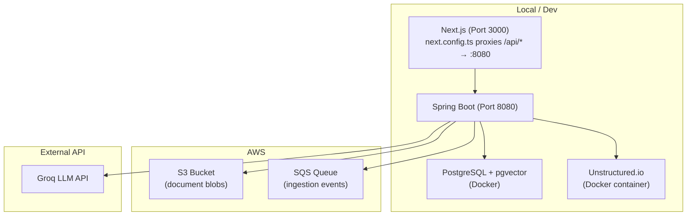

## Executive Summary

RAG Workspace is a production-grade, multi-tenant document intelligence system that transforms dense, complex PDFs into a queryable knowledge vault. Built end-to-end in a Spring Boot + Next.js stack, the system handles everything from secure browser-to-S3 uploads through asynchronous OCR processing, local vector embedding, and a multi-stage retrieval pipeline designed from the ground up to minimize hallucination. The result is a credible, grounded Q&A experience over private document sets — with strict tenant data isolation baked into the database schema itself.

---

## Project Overview

### What It Does

RAG Workspace ingests complex technical documents (PDFs), extracts and chunks their content, embeds them into a vector store, and exposes a chat interface where users can ask precise questions and receive cited, grounded answers. It is not a wrapper around a public LLM API — it is a full retrieval-augmented generation system with a thoughtfully engineered pipeline behind it.

### Who It Serves

The system is designed for multi-tenant deployments: multiple organizations or teams each operate within an isolated partition of the same infrastructure. Each tenant's documents, embeddings, and chat history are physically separated at the database level — not just filtered by a `WHERE tenant_id = ?` clause.

### The Problem It Solves

Using off-the-shelf LLMs directly against document corpora leads to hallucination, vague citations, and cross-contamination in shared environments. RAG Workspace addresses all three:

- **Hallucination** is reduced via multi-stage LLM grading and reranking before synthesis.
- **Citation quality** is enforced by grounding every answer in retrieved, verifiable chunks.
- **Data isolation** is enforced structurally via PostgreSQL table inheritance.

### My Role

I designed and built the entire system — architecture, backend, frontend, infrastructure wiring, and the RAG pipeline — independently. Every architectural decision described here was mine to make and justify.

---

## Architecture & System Design

The system follows a **modular monolith** pattern for the Spring Boot backend with **event-driven extensions** for the heavy processing workloads. The Next.js frontend operates as a thin workspace layer, delegating all business logic to the backend.

### High-Level Architecture

### Document Ingestion Pipeline

### Multi-Stage RAG Pipeline

---

## Key Technical Decisions

### ADR-1: Direct-to-S3 Uploads

**Decision:** Clients upload files directly to S3 using a pre-signed URL rather than routing through the Spring Boot server.

**Why:** Large PDFs passed through an application server tie up HTTP threads and spike heap usage. Pre-signed URLs eliminate this bottleneck entirely.

**Tradeoff:** The application must be fully asynchronous post-upload. There is no synchronous confirmation that a file arrived — that coordination happens through SQS events.

**Consequence:** The backend stays stateless and horizontally scalable. The cost is one additional hop in the ingestion lifecycle.

---

### ADR-2: Event-Driven Ingestion via SQS

**Decision:** Document processing (OCR, chunking, embedding) is triggered by S3 events consumed from SQS.

**Why:** OCR and embedding are CPU-intensive. Running them on the HTTP thread would cause client timeouts. SQS provides durability, retry guarantees, and clean decoupling.

**Tradeoff:** Error feedback must be written back to the database (`FAILED` status) rather than returned in the HTTP response — the client connection is already closed.

---

### ADR-3: Physical Tenant Isolation via PostgreSQL Table Partitioning

**Decision:** Each tenant receives a dedicated `document_embeddings` child table created via `CREATE TABLE ... INHERITS`, with its own HNSW index.

**Why:** A soft `tenant_id` filter is a security boundary enforced by application logic — one bug and data leaks. Physical partitioning makes cross-tenant reads structurally impossible.

**Tradeoff:** Partition-per-tenant doesn't scale to thousands of tenants. The current architecture is designed for hundreds of tenants operating on sizable document vaults.

---

### ADR-4: Multi-Stage LLM Retrieval

**Decision:** The RAG pipeline runs in four discrete stages: Query Expansion → Parallel Vector Search → LLM Reranking → Final Synthesis.

**Why:** Single-shot RAG produces shallow retrievals and hallucinated answers. Query expansion improves recall; LLM-based reranking improves precision before synthesis.

**Tradeoff:** The multi-LLM-call pipeline adds latency (currently 3–5+ seconds for external API calls). This is a conscious precision-over-speed tradeoff for a document analysis context.

---

## Implementation Highlights

### The `ChatService` RAG Orchestrator

The most technically sophisticated component is `ChatService`. It does not simply pass the user's query to a vector store and return the top-k results. Instead, it:

1. **Expands** the raw query into semantically varied alternatives using a structured `@AiService` prompt, improving vector search recall across different phrasings.
2. **Searches** all variations in parallel against the tenant's isolated PgVector partition, collecting a raw candidate pool.
3. **Deduplicates** candidates to prevent redundant context.
4. **Reranks** using a second LLM pass that grades each chunk's relevance before assembly.
5. **Synthesizes** a final answer grounded strictly in the curated, high-precision context.

This pipeline was designed with a single principle in mind: **the LLM should never be asked to synthesize from noise**.

### Multi-Tenant DDL at Runtime

`TenantOnboardingService` executes live DDL at tenant creation time, issuing `CREATE TABLE tenant_{uuid}_document_embeddings (LIKE document_embeddings INCLUDING ALL) INHERITS (document_embeddings)` alongside a dedicated HNSW index. This gives each tenant a fully independent vector search path with no application-level isolation logic needed at query time — the query is scoped by the table name extracted from the `UserPrincipal` JWT context.

### Direct Upload with Status Polling

The upload flow avoids any file bytes touching the Spring Boot process. The frontend's `UploadOverlay.tsx` requests a pre-signed URL, uploads directly to S3, then relies on `useDocuments.ts` polling to surface status transitions (`PENDING → PROCESSING → COMPLETED / FAILED`) in the dashboard. The intentional `.block()` in the SQS consumer ensures the SQS message is only acknowledged after the full ingestion pipeline completes — preventing silent message loss.

---

## Performance, Reliability & Constraints

### Performance Profile

| Concern              | Detail                                              |
| -------------------- | --------------------------------------------------- |
| RAG query latency    | 3–5+ seconds (multi-stage external LLM calls)       |
| Embedding throughput | CPU-bound; concurrency limited by local ONNX model  |
| SQS concurrency      | Hardcoded `max-concurrent-messages: 5`              |
| Frontend search      | Client-side Fuse.js — limited to metadata in memory |

### Reliability Considerations

- **SQS retries** provide automatic re-delivery on processing failure, enabling transient resilience without custom retry logic.
- **Document status tracking** (`PENDING / PROCESSING / COMPLETED / FAILED`) gives the backend a recoverable state model even when the client connection is long gone.
- **LLM reranking robustness**: The `parseIndices` method in `ChatService` is sensitive to LLM output format. Unexpected responses reduce retrieval accuracy rather than causing hard failures — a graceful degradation over a crash.

### Security Considerations

- Physical table partitioning provides structural tenant isolation at the database level.
- JWT validation on every request ensures tenant context is derived from a verified token, not a request parameter.
- **Known gaps:** Dynamic DDL construction via string concatenation (despite UUID validation) carries SQL injection risk. The `jwtToken` cookie is not `HttpOnly`. Rate limiting on upload and chat endpoints is absent.

---

## Deployment Architecture

The application is designed for container-based deployment with clear separation between the frontend and backend services.

- **Frontend**: Next.js proxies all `/api/*` traffic to the Spring Boot backend via `next.config.ts`, keeping the API surface hidden from the browser.
- **Backend**: Spring Boot serves REST endpoints and the SQS polling worker within the same process — a deliberate modular-monolith choice for development simplicity.
- **Infrastructure**: AWS S3 and SQS are the only cloud dependencies. PostgreSQL and Unstructured.io run as Docker containers.
- **Configuration**: AWS credentials, Groq API key, and DB connection strings are injected via environment variables.

---

## Future Improvements

| Area                   | Improvement                                                                                                         |
| ---------------------- | ------------------------------------------------------------------------------------------------------------------- |
| **UX**                 | Replace browser `alert()` / `confirm()` calls with a Toast notification system and custom modal dialogs             |
| **Real-time feedback** | Migrate document status updates from polling to WebSocket push notifications                                        |
| **Error transparency** | Surface structured failure reasons for document analysis failures (not just a `FAILED` status)                      |
| **Streaming RAG**      | Stream LLM synthesis responses token-by-token to reduce perceived latency                                           |
| **Security**           | Migrate `jwtToken` cookie to `HttpOnly`; add parameterized DDL for tenant onboarding; implement rate limiting       |
| **Performance**        | Replace external Groq calls in the RAG stages with a local LLM to eliminate network-bound latency                   |
| **Scalability**        | Evaluate pgvector schema alternatives (e.g., row-level tenancy with partitioned indexes) beyond hundreds of tenants |
| **Document support**   | Expand `DocParserService` beyond PDF to support Word, HTML, and plain text ingestion                                |

---

## Conclusion

RAG Workspace is a full-stack, production-oriented system that required making real architectural tradeoffs at every layer: how to upload files without saturating the server, how to isolate tenant data without trusting application-layer filters, how to build a RAG pipeline that is resistant to hallucination, and how to wire all of it into a coherent, deployable product.

The decisions made here — physical database partitioning, multi-stage LLM retrieval, local embedding inference, event-driven ingestion — reflect a consistent philosophy: **prefer structural guarantees over runtime assertions**, and **design pipelines for precision, not just speed**. The known limitations are documented honestly because engineering maturity includes knowing where the bodies are buried.

This project demonstrates the ability to design and deliver a complex, multi-concern system independently — spanning cloud infrastructure, backend services, AI pipelines, and a production-quality frontend — and to make defensible, well-reasoned decisions at each junction.

---

_Built with Spring Boot 3.x · Next.js 16 · React 19 · PostgreSQL + pgvector · AWS S3 + SQS · LangChain4j · Unstructured.io · Groq API · Tailwind CSS 4_
